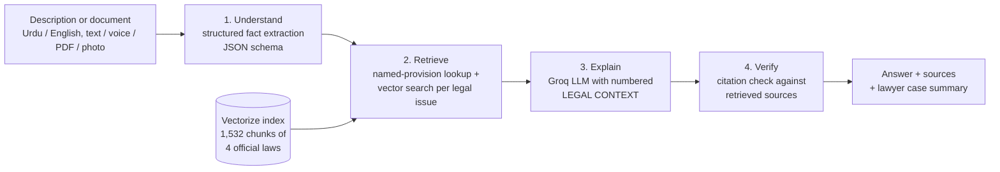

# PakLegal AI

**Understand your legal situation before you see a lawyer.** Describe what happened in Urdu or English, or upload a legal document, and get a plain-language explanation grounded in the official text of Pakistani law, with the exact Articles and Sections it used.

**Live demo:** https://paklegal-ai.mahnoorawan203.workers.dev

---

## The problem

Two everyday situations send people to a lawyer before they understand anything themselves:

1. **"Let me tell you what happened."** People explain an incident out loud while the lawyer takes notes. They don't know which laws apply, what their rights are, or what details matter.
2. **"What does this notice even say?"** People pay a lawyer just to read a legal notice, summons or court order to them in plain words.

## What PakLegal AI does

| Problem | Feature | What it does |
|---|---|---|
| 1 | **Explain My Situation** (main feature) | The person writes or speaks the incident in their own words. The system extracts the facts into a structured record, retrieves the provisions that apply, explains the law, their rights and next steps, and produces a **case summary to hand to their lawyer** (plus an FIR application to the SHO when it is a possible crime). Follow-up questions are answered in the same context. |
| 2 | **Document Explainer** | Upload a PDF or a phone photo. Get a plain Urdu/English summary, deadlines, obligations and risks, and the provisions the document cites explained from their official text. |
| Both | **Search the Law** | Semantic search over the official text, in Urdu or English, with no AI writing: every result is the law itself. |

A floating chat is also available on every page for quick questions, grounded the same way.

---

## How it works



1. **Understand.** The model turns the free-text description into a validated JSON record (Groq structured outputs + zod): summary, timeline, people, losses, evidence, missing details, and one plain-English search phrase per legal issue.
2. **Retrieve.** Provisions the person names ("Section 489-F PPC", "دفعہ 302") are fetched directly by ID. Each legal issue is embedded with a multilingual model (`bge-m3`) and searched in Cloudflare Vectorize; results are interleaved so every issue gets its best provisions, weak matches are dropped (similarity below 0.5, or more than 0.1 below the best), and the total is capped to fit the free-tier token budget.
3. **Explain.** The LLM gets the facts and the numbered provisions, with rules: cite as `[1]`, never cite anything not in the context, and say so when the sources do not cover the situation.
4. **Verify.** Every Section/Article in the answer is checked against the retrieved sources and the catalogue of real provisions. Anything unsupported or non-existent is shown to the user as "please verify".

The **case summary** and **FIR application** are assembled by plain code from the validated facts and retrieved sources, not generated by the model, so they cannot contain invented facts or sections.

### Knowledge base

| Law | Provisions | Source |
|---|---|---|
| Constitution of Pakistan, 1973 | 309 Articles | Pakistan Code (official PDF) |
| Pakistan Penal Code, 1860 | 604 Sections | Pakistan Code |
| Code of Criminal Procedure, 1898 | 472 Sections | Pakistan Code |
| Prevention of Electronic Crimes Act, 2016 (incl. 2025 amendments) | 80 Sections | Pakistan Code |

`scripts/rag/build-knowledge.mjs` downloads each PDF, strips page headers, amendment footnotes and markers, uses the table of contents to split the body into one chunk per provision (long ones into parts), and records law, number, title, source URL and text. 1,465 of 1,505 listed provisions (97%) are matched; the rest stay attached to the neighbouring provision.

---

## Evaluation

`npm run rag:eval` runs 40 legal questions (28 English, 12 Urdu) and 5 off-topic questions from [`knowledge/eval/questions.json`](knowledge/eval/questions.json) against the live index. Full results: [`knowledge/eval/results.md`](knowledge/eval/results.md).

| Metric | With glossary | Without glossary |
|---|---|---|
| Hit@1 (correct provision ranked first) | 63% | 53% |
| Hit@3 | 80% | 68% |
| Hit@5 (correct provision sent to the model) | 88% | 78% |
| MRR | 0.72 | 0.61 |
| Hit@3, Urdu questions | 83% | 58% |
| Off-topic questions correctly rejected | 100% | 100% |

- The small **glossary** that adds statutory wording to everyday terms ("FIR" → "information in cognizable cases") adds 10 points at Hit@1 and 25 points for Urdu questions.
- Most misses are structural: the PPC defines an offence and punishes it in **separate neighbouring sections** (300/302 qatl-i-amd, 405/406 criminal breach of trust, 441/448 trespass, 415/420 cheating), and retrieval often ranks the definition first. Linking definition and punishment sections is the next improvement.
- The glossary was written before this test set and was not tuned on it.

---

## Design decisions

- **Two focused features instead of seven.** Earlier versions also generated bail applications, legal notices and consumer complaints. They were removed: they repeated one skill (form → prompt → document), and the model invented case law and authority addresses that the knowledge base could not ground.
- **Generated documents are templates, not LLM output.** A citizen does not write the FIR (the police record it under s.154 CrPC); they submit an application to the SHO, which is built from their own words.
- **Cloudflare Vectorize + Workers AI.** The app already runs on Cloudflare Workers, so retrieval needs no extra service or API key. The laws (1.3M characters) are too large to bundle into a Worker.
- **Thresholds from data.** On test questions, relevant provisions scored 0.53-0.77 and off-topic questions at most 0.43, so the cut-off is 0.5.
- **Token budget.** Groq's free tier allows 8,000 tokens/minute, which limits context to about 5 provisions and shapes the fact-extraction step (low reasoning effort, and the facts rather than the raw narrative go to the second call).
- **Photos:** the free vision model allows only about 1,000 output tokens/minute, so it only transcribes; the main model does the analysis.

## Limitations

- Covers four laws. Family, tenancy, labour and consumer law are not loaded yet, and the app says so instead of guessing.
- The model can still misapply a provision; the citation check catches invented or unretrieved numbers, not wrong reasoning. Everything is legal information, not legal advice.
- Free-tier rate limits: heavy simultaneous use returns "try again in a minute".

---

## Tech stack

- **App:** [TanStack Start](https://tanstack.com/start) (React 19 + SSR), TypeScript, Tailwind CSS v4, Urdu/English with RTL
- **Hosting:** Cloudflare Workers
- **LLM:** [Groq](https://console.groq.com/) running `openai/gpt-oss-120b` (vision: `qwen/qwen3.8-27b`)
- **RAG:** Cloudflare Workers AI embeddings (`@cf/baai/bge-m3`, multilingual) + Cloudflare Vectorize
- **Documents:** `unpdf` for PDF text; browser speech recognition for voice input
- **Quality:** zod validation, vitest unit tests, GitHub Actions CI (type-check, lint, tests, build)

---

## Getting started

Prerequisites: Node.js 22+, a free [Groq API key](https://console.groq.com/keys), and a free Cloudflare account.

```bash
git clone https://github.com/maan203/paklegal-ai.git
cd paklegal-ai
npm install
echo "GROQ_API_KEY=your_groq_api_key" > .env.local
npx wrangler login
```

Build the legal knowledge base in your Cloudflare account (once):

```bash
npm run rag:index     # create the "paklegal-laws" Vectorize index
npm run rag:ingest    # embed and upload knowledge/chunks/*.json
npm run rag:eval      # optional: measure retrieval quality
```

Run and check:

```bash
npm run dev           # http://localhost:3000 (RAG_OFFLINE=1 npm run dev runs without Cloudflare)
npm test              # unit tests
npm run typecheck && npm run lint
```

Deploy (set the key as a Worker secret once):

```bash
npx wrangler secret put GROQ_API_KEY
npm run deploy
```

### Adding a law

1. Add an entry to `src/lib/rag/laws.ts` (name, Pakistan Code PDF URL, English/Urdu names).
2. `npm run rag:build -- <law-id>` builds `knowledge/chunks/<law-id>.json`.
3. `npm run rag:ingest -- <law-id>` uploads it. No other code changes are needed.

---

## Project structure

```
src/
├── routes/
│   ├── index.tsx           # Home: the two problems and how it works
│   ├── situation.tsx       # Explain My Situation
│   ├── translator.tsx      # Document Explainer
│   └── law.tsx             # Search the Law
├── components/
│   ├── LegalSources.tsx    # Cited / unused sources + citation warnings
│   ├── ChatThread.tsx      # Chat messages with sources (bubble + follow-ups)
│   ├── ChatWidget.tsx      # Floating quick-question chat
│   └── DocumentResult.tsx  # Copy / print for generated documents
├── lib/
│   ├── ai-functions.ts     # Server functions: extraction, grounded answers, search
│   ├── case-summary.ts     # Lawyer case summary + FIR application (templates)
│   └── rag/
│       ├── laws.ts         # Law registry (add laws here)
│       ├── retrieve.ts     # Direct lookup + vector search + cut-offs
│       ├── references.ts   # Finds "Section 489-F PPC" / "دفعہ 302" in text
│       ├── context.ts      # Context block, citation rules, citation check
│       └── glossary.ts     # Everyday terms -> statutory wording
└── hooks/                  # useLegalChat, useSpeechInput, useLocalStorage
scripts/rag/                # build-knowledge, ingest, eval
knowledge/                  # law chunks + evaluation set and results
tests/                      # vitest unit tests
```

---

## Disclaimer

PakLegal AI provides **general legal information, not legal advice**. It is not a substitute for a qualified lawyer.

## License

MIT
